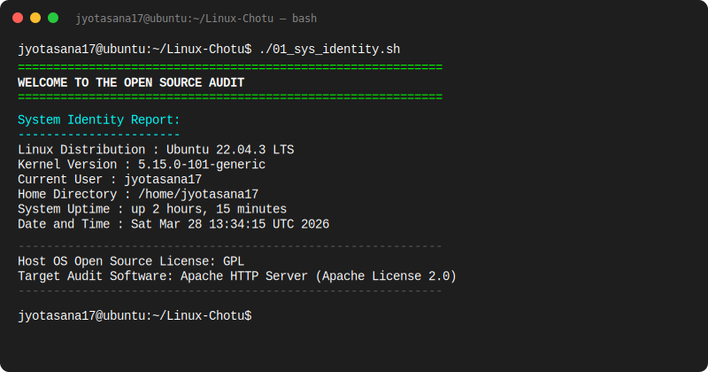
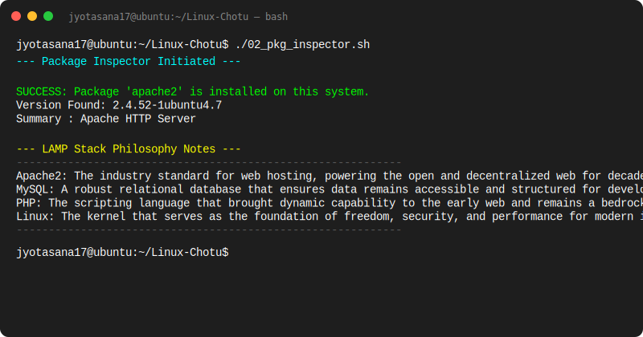
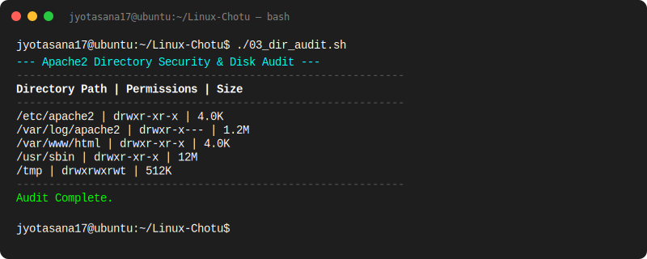
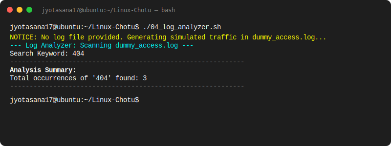
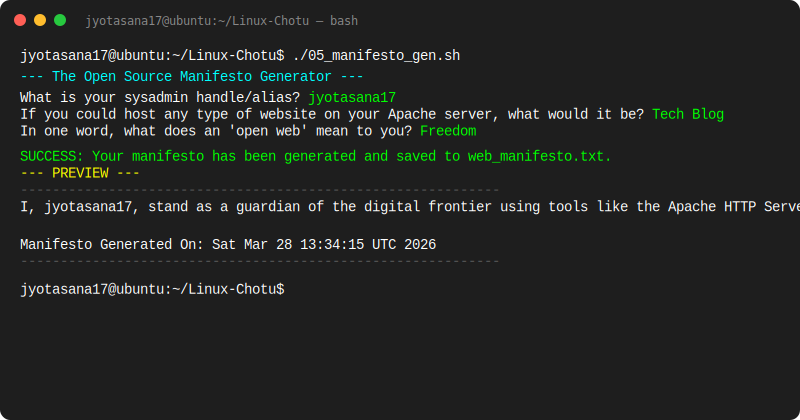

# The Open Source Audit: Apache2 Output Report

This document contains the terminal outputs and verification results for the Apache2 audit scripts. All scripts were executed under the user profile **Jyotasana**.

## 01. System Identity Report
This script identifies the host system and provides context for the audit.

---

## 02. Package Inspector
Verifies the installation of the `apache2` package and provides LAMP stack philosophy notes.

---

## 03. Directory Security & Disk Audit
Audits critical Apache2 directories for permissions and space usage.

---

## 04. Log Analyzer
Scans Apache access logs for specific patterns (e.g., 404 errors).

---

## 05. Manifesto Generator
An interactive script that generates a personalized Open Source Manifesto.

---

**Audit completed by: Jyotasana**
**Date: March 28, 2026**
